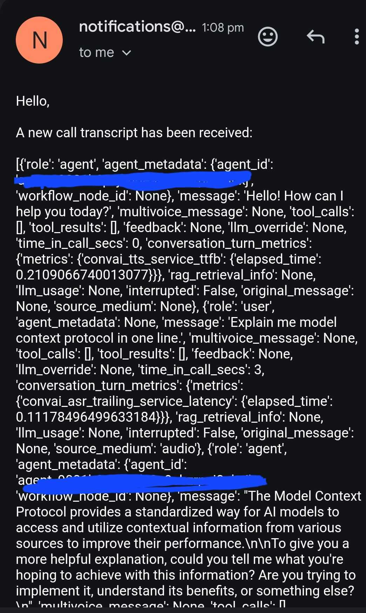

**POST CALL TRANSCRIPT WEBHOOK**

This project is flask based webhook receiver that listens for post-call transcripts and automatically triggers the transcript to a specified address.


The following are the steps followed in pipeline:

- Secure webhook validation with HMAC signature verification
- Extracts the call transcript from the webhook payload
- Sends an email notification with the transcript
- Configurable via environment variables


### Steps to run the repository

Clone the repository

```bash
git clone https://github.com/uchiha-vivek/ElevenLabs-post-call-webhook.git
cd ElevenLabs-post-call-webhook
```

Activate the environment and install the packages

```bash
python -m venv venv
venv\Scripts\activate
pip install -r requirements.txt
```

Run the server

```bash
python server.py
```


### Open the ngrok window

Run the following command

```bash
ngrok http 5000
```

You will receive a link like this

```bash
Forwarding                    https://0963ce61eb42.ngrok-free.app -> http://localhost:5000      
```


Now in elevenlabs agent , you need to insert this in **Post-Call webhook** section under **security tab**


<a href="https://github.com/uchiha-vivek/ElevenLabs-post-call-webhook">
    
</a>


Transcript Notification email

<a href="https://github.com/uchiha-vivek/ElevenLabs-post-call-webhook">
    
</a>


You need to integrate the following url

```bash
https://0963ce61eb42.ngrok-free.app/post-call-support
```

**/post-call-support** route is mandatory


After the voice conversation ends , you will receive email notification for the transcript


Future integrations which will be made:

- Extracting necessary userinfo like name and email from conversation
- Storing this userinfo in azure cosmos db/ azure dynamodb
- triggering clickup notifications
- making custom functionalities like average call/total duration and customize stuff.


